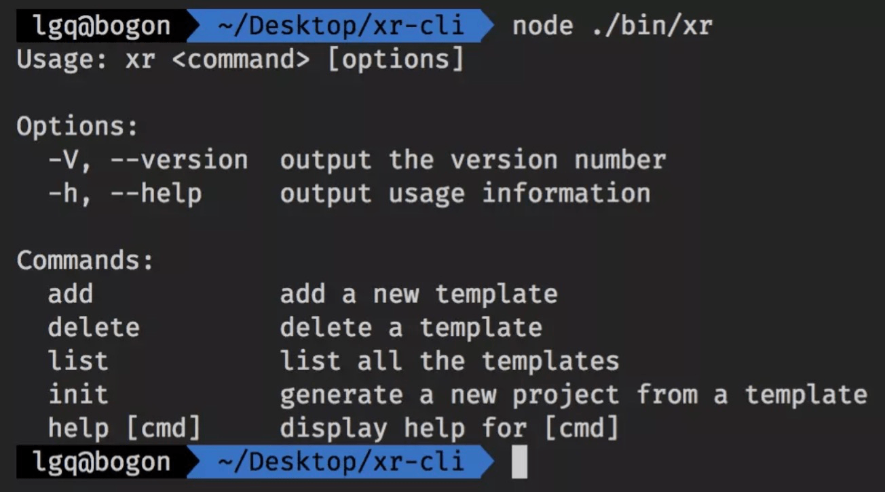
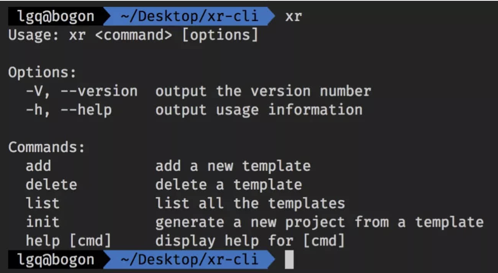
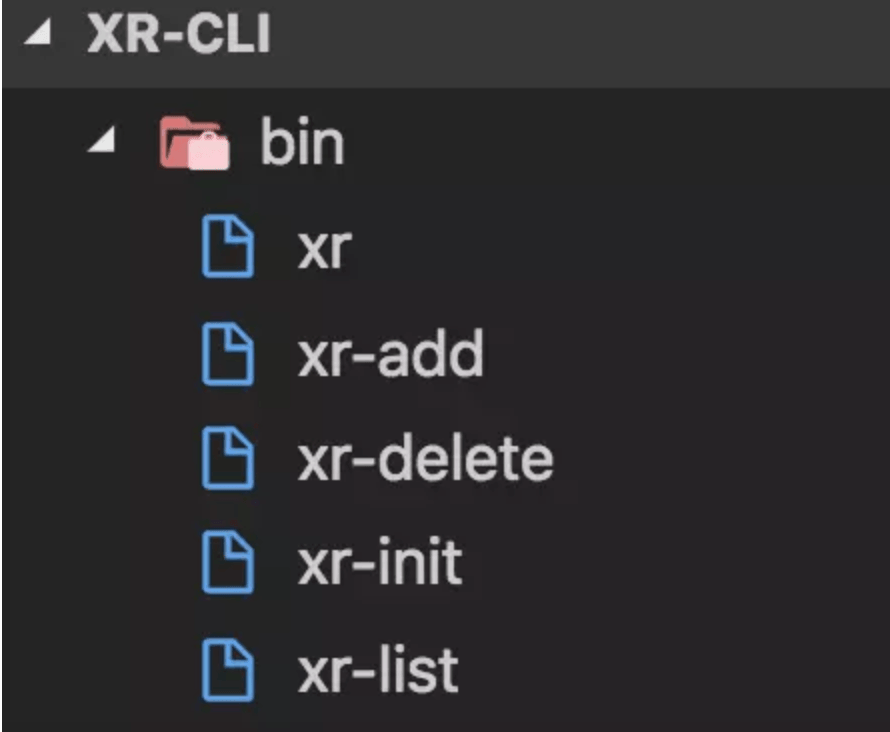
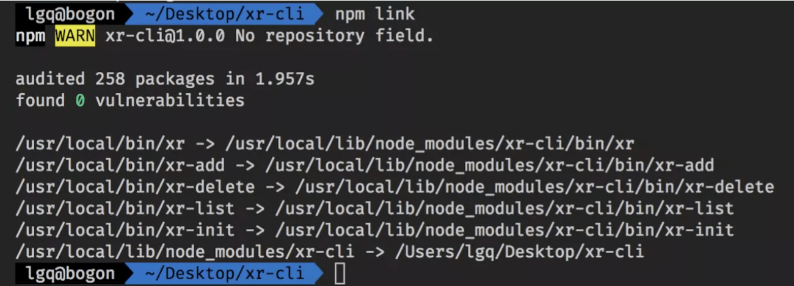
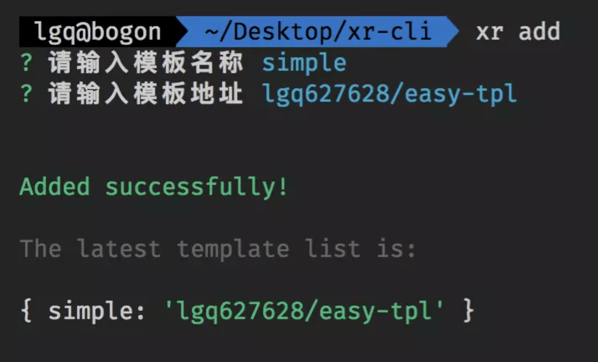
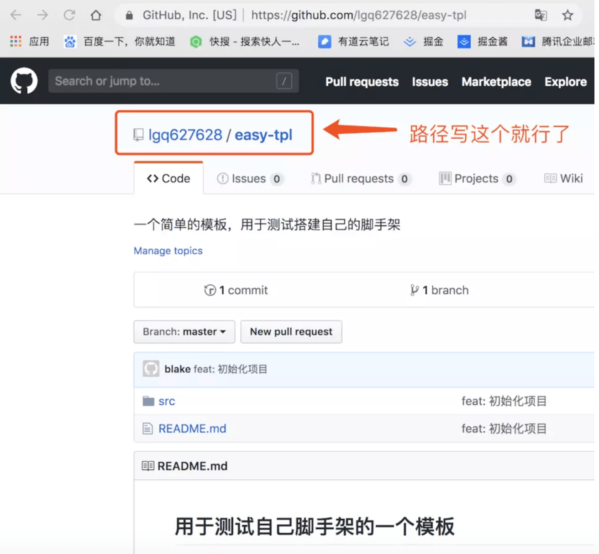
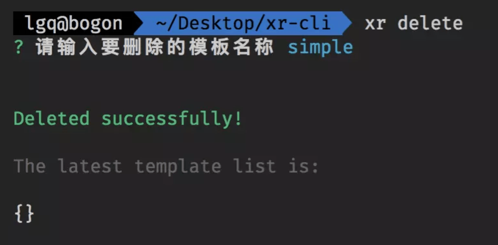
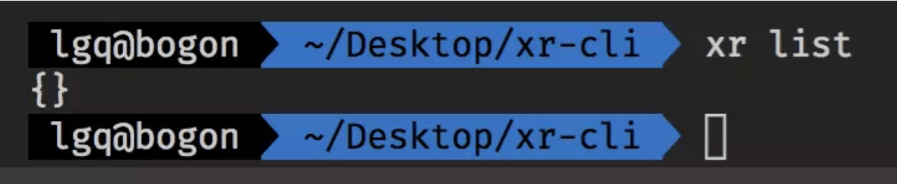
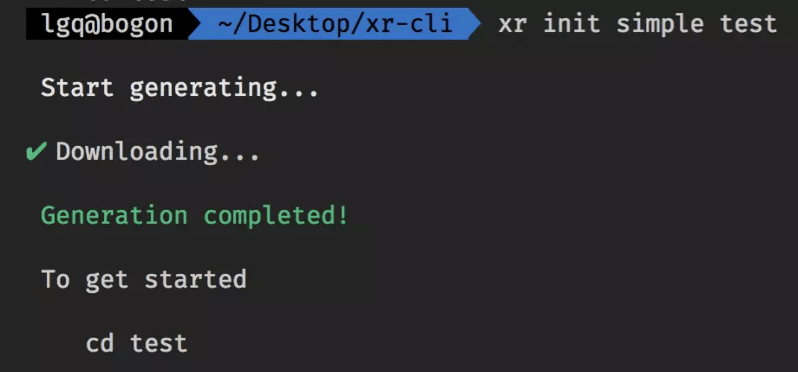
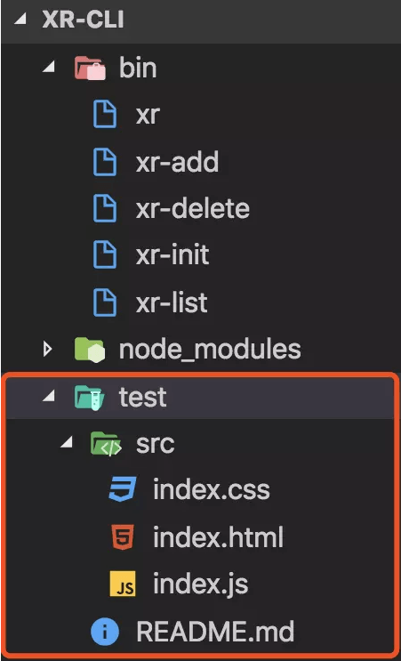

# scaffold 脚手架-cli

> 本文主要讲解什么是脚手架、作用以及仿vue-cli搭建属于自己的脚手架，目标是实现一个 cli init template-name project-name 这样的命令

## 什么是脚手架 ？
  **scaffold** ：[ˈskæfoʊld]&nbsp;&nbsp;&nbsp;&nbsp;中式发音：丝盖否的</br>
  简单的说脚手架是属于建筑时用到的一种工具，为安全施工、方便施工而搭建的工作平台（铁架子）。</br>
  程序开发引入的脚手架也是开发工具的一种，业内称为<font color="red">**CLI**</font>，定位基本一致：**创建项目初始文件**,本质是从远程下载一个模板来进行一个新项目,可理解为高级版的克隆，它主要是提供了交互式的命令让我们可以动态的更改模板，然后用一句命令就可以一劳永逸了。</br>
  例如常见的 <font color="red">vue-cli</font> 、<font color="red">create-react-app</font> 、<font color="red">react-native-cli</font>等。

## 为什么要用脚手架 ？
  1、快速搭建项目模板</br>
  2、减少重复性工作，提升开发效率和开发舒适性</br>
  3、多人协作更为方便，不需要把文件传来传去</br>
## 优秀的脚手架应该具备以下几要素
  1、丰富但不繁琐的配置项；</br>
  2、与其他功能模块联动，生成对应的基本配置项；</br>
  3、自动安装依赖；</br>
  4、底层的高度可扩展性；</br>
  5、支持多种运行环境，比如命令行和Node.js API</br>
## 开发前准备工作
+ #### 思路 （借鉴 vue-cli）
  vue-cli 是将项目模板放在 git 上，运行的时候再根据用户交互下载不同的模板，经过模板引擎渲染出来，生成项目。这样将模板和脚手架分离，就可以各自维护，即使模板有变动，只需要上传最新的模板即可，而不需要用户去更新脚手架就可以生成最新的项目。那么就可以按照这个思路来进行开发了。
+ #### 使用的工具库
  1、<font color="red">**NodeJs**</font></br>
  > 还不了解nodejs的请点击浏览器右上角或左上角关闭按钮。。。不送😂</br>

  2、<font color="red">**commander.js**</font>：可以自动的解析命令和参数，用于处理用户输入的命令。</br>
  > 回忆一下，我们曾用过的 vue init 的命令就是这样声明的。
  ```js
  const program = require("commander");
  // 定义指令
  program
    .version('0.0.1')
    .command('init', 'Generate a new project from a template')
    .action(() => {
      // 回调函数
    })
  // 解析命令行参数
  program.parse(process.argv);
  ```
  3、<font color="red">**download-git-repo**</font>：下载并提取 git 仓库，用于下载项目模板。</br>
  > 这是用来下载远程模板的，支持 GitHub、 GitLab 和 Bitbucket 等，用法如下：
  ````js
  const download = require('download-git-repo')
  download(repository, destination, options, callback)
  /*
  **  repository : 远程仓库地址
  **  destination : 存放下载的文件路径,也可以直接写文件名，默认就是当前目录
  **  options : 一些选项 
  **            比如 { clone：boolean } 表示用 http download 还是 git clone 的形式下载
  */
  ````
  4、<font color="red">**inquirer.js**</font>：通用的命令行用户界面集合，用于和用户进行交互。</br>
  > 想象一下我们用 vue init webpack project-name 之后是不是会有几个交互问题，问你文件名啊、</br>
    作者啊、描述啊、要不要用 eslint 啊等等之类的，就是用这个来写的
  ```js
  const inquirer = require('inquirer');
  inquirer
    .prompt([
      // 一些交互式的问题
    ])
    .then(answers => {
      // 回调函数，answers 就是用户输入的内容，是个对象
    }); 
  ```
  5、<font color="red">**ora**</font>：下载过程久的话，可以用于显示下载中的动画效果。</br>
  > 这是一个好看的加载，就是你下载的时候会有个转圈圈的那种效果，用法如下：
  ````js
  const ora = require('ora')
  let spinner = ora('downloading template ...')
  spinner.start()
  ````
  6、<font color="red">**chalk**</font>：可以给终端的字体加上颜色。</br>
  > 这是用来修改控制台输出内容样式的，比如颜色啊，具体用法如下：
  ````js
  const chalk = require('chalk');
  console.log(chalk.green('success'));
  console.log(chalk.red('error'));
  ````
  ## 开始搭建脚手架
  > ok，有了上面的知识储备之后，我们就正式开始撸了。
+ #### 第一步：目录搭建
  > 注意<font color="red"> #!/usr/bin/env node </font>这句话不要遗漏，详情如下：

  ````js
      1.首先我们要创建一个文件夹，并取名叫 xr-cli；

      2.在该目录下执行 npm init 命令，一路回车，就会生成一个生成 package.json 文件，
        在 package.json 里面写入以下依赖并执行 npm install 安装，如下：
          "dependencies": {
            "chalk": "^2.4.2",
            "commander": "^2.19.0",
            "download-git-repo": "^1.1.0",
            "inquirer": "^6.2.2",
            "ora": "^3.2.0"
          }

      3.新建一个 bin 文件夹，并在 bin 目录下新建一个无后缀名的 xr 文件，并写上：
          #!/usr/bin/env node
          console.log('hello');
        /*
        ** 这个文件就是我们整个脚手架的入口文件，我们用 node ./bin/xr 运行一下，可打印出 hello
        ** 这里要注意开头的 #!/usr/bin/env node 这个语句必须加上，主要是为了让系统看到这一行
        ** 的时候，会沿着该路径去查找 node 并执行，主要是为了兼容 Mac ，确保可执行。
        */ 
  ````
+ #### 第二步：bin 目录初始化
  当前，bin 目录下就只有一个文件，就是入口文件 xr。所以现在我们先来编写这个文件，由于内容较少，我们直接看代码：

  ````js
    #!/usr/bin/env node

    const program = require('commander')

    // 定义当前版本
    // 定义使用方法
    // 定义四个指令
    program
      .version(require('../package').version)
      .usage('<command> [options]')
      .command('add', 'add a new template')
      .command('delete', 'delete a template')
      .command('list', 'list all the templates')
      .command('init', 'generate a new project from a template')
      
    // 解析命令行参数
    program.parse(process.argv)
  ````
  这个文件的主要作用就是定义指令，现在我们用 node ./bin/xr 运行一下，就能看到如下结果：

  

  当然，你可能会觉得每次输入 node ./bin/xr 这个命令有点麻烦，没关系，我们可以在 package.json 里面写入已下内容：
  ````js
    // bin 用来指定每个命令所对应的可执行文件的位置
    "bin": {
        "xr": "bin/xr"
    }
  ````
  然后在根目录下执行 npm link（就是把命令挂载到全局的意思），这样我们每次只要输入 xr，就可以直接运行了，就像下面这样：

  

  是不是好像有点样子了呢😁😁😁，那就让我们继续完善下 bin 目录吧！ok，让我们在 bin 目录下再新建四个文件，分别对应上面的四个指令，然后分别处理四个指令要做的事情，如下图：

  

  同样的，我们修改一下 package.json 里面的 bin 内容，如下：

  ````js
    "bin": {
      "xr": "bin/xr",
      "xr-add": "bin/xr-add",
      "xr-delete": "bin/xr-delete",
      "xr-list": "bin/xr-list",
      "xr-init": "bin/xr-init"
    }
  ````
  然后执行 npm unlink 解绑全局命令，再执行 npm link 重新把命令绑定到全局，就像下面这样：

  

  最后顺便在根目录下新建一个 <font color="red">**template.json**</font> 文件，里面的内容就是一个 <font color="red">**{}**</font>。

+ #### 第三步：编写具体指令
  > 好了，一切准备就绪，接下来就让我们来写下具体的四个指令吧。

  **1、编写xr-add文件：**
    ````js
    #!/usr/bin/env node

    // 交互式命令行
    const inquirer = require('inquirer')
    // 修改控制台字符串的样式
    const chalk = require('chalk')
    // node 内置文件模块
    const fs = require('fs')
    // 读取根目录下的 template.json
    const tplObj = require(`${__dirname}/../template`)

    // 自定义交互式命令行的问题及简单的校验
    let question = [
      {
        name: "name",
        type: 'input',
        message: "请输入模板名称",
        validate (val) {
          if (val === '') {
            return 'Name is required!'
          } else if (tplObj[val]) {
            return 'Template has already existed!'
          } else {
            return true
          }
        }
      },{
        name: "url",
        type: 'input',
        message: "请输入模板地址",
        validate (val) {
          if (val === '') return 'The url is required!'
          return true
        }
      }
    ]

    inquirer.prompt(question).then(answers => {
      // answers 就是用户输入的内容，是个对象
      let { name, url } = answers;
      // 过滤 unicode 字符
      tplObj[name] = url.replace(/[\u0000-\u0019]/g, '')
      // 把模板信息写入 template.json 文件中
      fs.writeFile(`${__dirname}/../template.json`, JSON.stringify(tplObj), 'utf-8', err => {
        if (err) console.log(err)
        console.log('\n')
        console.log(chalk.green('Added successfully!\n'))
        console.log(chalk.grey('The latest template list is: \n'))
        console.log(tplObj)
        console.log('\n')
      })
    })
    ````
  这个文件主要目的就是添加模板并存储起来，上面的注释应该都写的挺清楚了。我们执行 xr add 来看看效果：

  

  这里的模板名称（自己随便取）相当于 <font color="red">**vue init webpack project-name**</font> 当中的 <font color="red">**webpack**</font>；模板地址要注意一下，像下面这样写就可以，这里以 github 为例：

  

  这里补充一下 <font color="red">xr add</font> 怎么对应到 xr-add 的：</br>
  我们前面在定义 <font color="red">program.command('add').action(() => {})</font> 的时候没有写 action 这个回调函数，而当我们执行 <font color="red">xr add</font> 的时候，commander 会尝试在入口脚本的目录中搜索可执行文件，找到形如 <font color="red">program-command</font>（这里就是 <font color="red">xr add</font>）的命令来执行，大概这么个意思，下面命令也是一样的道理。.

  **2、编写xr-delete文件：**
    ````js
    #!/usr/bin/env node

    const inquirer = require('inquirer')
    const chalk = require('chalk')
    const fs = require('fs')
    const tplObj = require(`${__dirname}/../template`)

    let question = [
      {
        name: "name",
        message: "请输入要删除的模板名称",
        validate (val) {
          if (val === '') {
            return 'Name is required!'
          } else if (!tplObj[val]) {
            return 'Template does not exist!'
          } else  {
            return true
          }
        }
      }
    ]

    inquirer
      .prompt(question).then(answers => {
        let { name } = answers;
        delete tplObj[name]
        // 更新 template.json 文件
        fs.writeFile(`${__dirname}/../template.json`, JSON.stringify(tplObj), 'utf-8', err => {
          if (err) console.log(err)
          console.log('\n')
          console.log(chalk.green('Deleted successfully!\n'))
          console.log(chalk.grey('The latest template list is: \n'))
          console.log(tplObj)
          console.log('\n')
        })
      })
    ````
  执行 xr delete 看下效果：

  

  **3、编写xr-list文件：**

    ```js
    #!/usr/bin/env node

    const tplObj = require(`${__dirname}/../template`)
    console.log(tplObj)
    ````
  执行 xr list 看看效果：

  

  因为刚才一添加一删除，所以目前没有模板，就输出 <font color="red">{}</font>。

  **4、编写xr-init文件：**

  这应该是最主要（但不难）的一步了，重点就是执行 download 方法，并传入相应参数，具体看代码：

  ````js
    #!/usr/bin/env node

    const program = require('commander')
    const chalk = require('chalk')
    const ora = require('ora')
    const download = require('download-git-repo')
    const tplObj = require(`${__dirname}/../template`)

    program
      .usage('<template-name> [project-name]')
    program.parse(process.argv)
    // 当没有输入参数的时候给个提示
    if (program.args.length < 1) return program.help()

    // 好比 vue init webpack project-name 的命令一样，第一个参数是 webpack，第二个参数是 project-name
    let templateName = program.args[0]
    let projectName = program.args[1]
    // 小小校验一下参数
    if (!tplObj[templateName]) {
      console.log(chalk.red('\n Template does not exit! \n '))
      return
    }
    if (!projectName) {
      console.log(chalk.red('\n Project should not be empty! \n '))
      return
    }

    url = tplObj[templateName]

    console.log(chalk.white('\n Start generating... \n'))
    // 出现加载图标
    const spinner = ora("Downloading...");
    spinner.start();
    // 执行下载方法并传入参数
    download (
      url,
      projectName,
      err => {
        if (err) {
          spinner.fail();
          console.log(chalk.red(`Generation failed. ${err}`))
          return
        }
        // 结束加载图标
        spinner.succeed();
        console.log(chalk.green('\n Generation completed!'))
        console.log('\n To get started')
        console.log(`\n    cd ${projectName} \n`)
      }
    )
  ````

  ok，我们执行一下 <font color="red">xr init simple test</font>，记得先执行一下 <font color="red">xr add</font>：

  

  现在我们就可以在左侧的目录中看到 test 项目了，如下图：

  

  至此，一个小小的脚手架就做完了。此处应该有掌声👏👏👏
  
## 总结
  虽然前端脚手架没有固定形态，但是有必须具备的要素。从功能实现的角度，要考虑与业务的高度匹配；从底层框架的角度，要具备高度的可扩展性和执行环境多样性支持。

