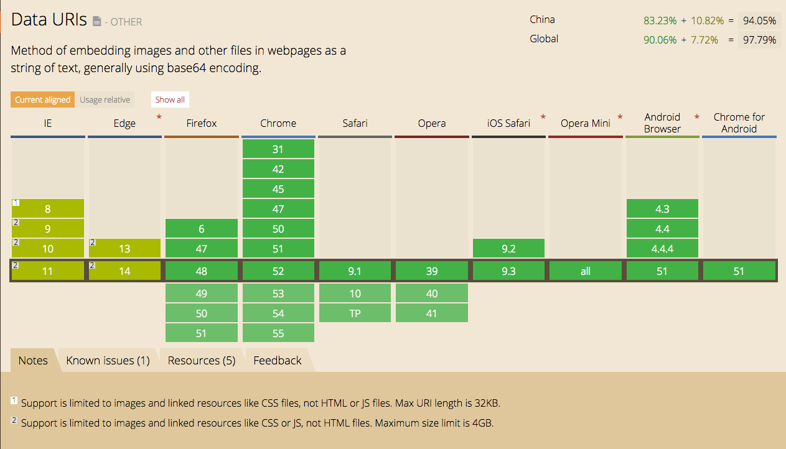
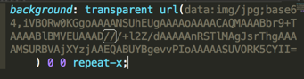
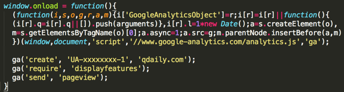

# 移动端性能优化总结（一）

过去一段时间我参与了移动端的开发，遇到了许多与性能优化方面的问题，遂做了详细的总结。

## 优化网页加载速度
像我们最近做的各种落地页无论是设计还是内容都追求高品质，于是丰富的图文混合成了标配：顶部的banner图，课程介绍的配图，有趣的gif图等等。<br/>
特别严重的时候，一篇文章有十多个gif图，加载花费的时间10-20秒之长，加载消耗的流量几十M之多，严重影响了用户体验！尤其是Mobile端，一寸流量一寸金；3-5s打不开页面，用户都会直接逃离。所以网页加载速度优化势在必行！

<b>我们都知道一个网页的加载流程大致如下：</b><br/>
1、解析HTML结构。<br/>
2、加载外部脚本和样式表文件。<br/>
3、解析并执行脚本代码。// 部分脚本会阻塞页面的加载<br/>
4、DOM树构建完成。//DOMContentLoaded 事件<br/>
5、加载图片等外部文件。<br/>
6、页面加载完毕。//load 事件<br/>
一句话就是：请求HTML，然后顺带将HTML依赖的JS/CSS/iconfont等其他资源一并请求过来。<br/>
那么优化网页的加载速度，最本质的方式就是：<b>减少请求数量 与 减小请求大小</b>。<br/>

<b>减小请求数量</b><br/>
1、将小图标合并成sprite图或者iconfont字体文件<br/>
2、用base64减少不必要的网络请求<br/>
3、图片延迟加载<br/>
4、JS/CSS按需打包<br/>
5、延迟加载ga统计<br/>
6、等等...<br/>

<b>减小请求大小</b><br/>
1、JS/CSS/HTML压缩<br/>
2、gzip压缩<br/>
3、JS/CSS按需加载<br/>
4、图片压缩，jpg优化<br/>
5、webp优化 & srcset优化<br/>
6、等等...<br/>

JS/CSS按需打包 和 JS/CSS按需加载是两个不同的概念：<br/>
JS/CSS按需打包是预编译发生的事情，保证只打包当前页面相关的逻辑。<br/>
JS/CSS按需加载是运行时发生的事情，保证只加载当前页面第一时间使用到的逻辑。<br/>

接下来我们将结合两个本质的优化方式介绍具体的实践方法。

### 如何减少请求数量？

### 1.合并图标，减少网络请求

合并图标是减少网络请求的常见的优化手段，网页中的小图标特征是体积小、数量多，而浏览器同时发起的并行请求数量又是有限制的，所以这些小图标会严重的影响网页的加载速度，阻碍关键内容的请求和呈现.

<b>sprite图</b><br/>
合并sprite图是慢工细活儿，并没有特别大的技术含量，但却是每个前端开发都必须掌握的技术。<br/>
刚入门的前端直接手动切图拼图即可。<br/>
经验丰富的前端可以尝试利用构建工具实现自动化，推荐使用。<b>gulp.spritesmith</b>插件。

```js
// 构建视图文件
gulp.task('sprites', function() {
    var spriteData = gulp.src(config.src)
        .pipe(plumber(handleErrors))
        .pipe(newer(config.imgDest))
        .pipe(logger({ showChange: true }))
        .pipe(spritesmith({
            cssName: 'sprites.css',
            imgName: 'sprites.png',
            cssTemplate: path.resolve('./gulp/lib/template.css.handlebars')
        }));

    var imgStream = spriteData.img
        .pipe(buffer())
        .pipe(gulp.dest(config.imgDest));

    var cssStream = spriteData.css
        .pipe(gulp.dest(config.cssDest));

    return merge([imgStream, cssStream]);
});
```
sprite图不适合无线端的响应式场景，所以越来越作为一个备用方案。

<b>iconfont字体文件</b><br/>
iconfont字体文件是用字体编码的形式来实现图标效果，既然是文字，那就可以随意设置颜色设置大小，相对来说比sprite方案更好。但是它只适用于纯色图标。推荐使用 <b>阿里巴巴矢量图标库</b>

### 2.用base64减少不必要的网络请求

<br/>

上文提到的sprite图和iconfont字体文件，对于有些场景并不适合，比如：<br/>
1、小背景图，无法放到精灵图中，通常循环平铺小块来设置大背景。<br/>
2、小gif图，无法放到精灵图中，发请求又太浪费。<br/>

<br/>

::: warning 注意
cssnano压缩css的时候，对于部分规则的base64 uri不能识别，会出现误伤，如下图，cssnano压缩的时候会将压缩为：
<br/>
:::

原因是：cssnano会跳过data:image/data:application后面的字符串，但是不会跳过data:img，所以如果你使用的工具生成的是data:img，建议换工具或者直接将其修改为data:image。

#### 3.图片延迟加载

图片是网页中流量占比最多的部分，也是需要重点优化的部分。<br/>
图片延迟加载的原理就是先不设置img的src属性，等合适的时机（比如滚动、滑动、出现在视窗内等）再把图片真实url放到img的src属性上。<br/>

<b>固定宽高值的图片</b>
固定宽高值的图片延迟加载比较简单，因为宽高值都可以设置在css中，只需考虑src的替换问题，推荐使用<a>lazysizes</a>。

```js
// 引入js文件
<script src="lazysizes.min.js" async=""></script>

// 非响应式 例子


// 响应式 例子，自动计算合适的图片

// iframe 例子
<iframe frameborder="0"
    class="lazyload"
    allowfullscreen=""
    data-src="//www.youtube.com/embed/ZfV-aYdU4uE">
</iframe>
```
::: warning 注意
注意：浏览器解析img标签的时候，如果src属性为空，浏览器会认为这个图片是坏掉的图，会显示出图片的边框，影响市容。
:::

<br/>
<br/>

lazysizes延迟加载过程中会改变图片的class：默认lazyload，加载中lazyloading，加载结束：lazyloaded。结合这个特性我们有两种解决上述问题办法：<br/>
1、设置opacity:0，然后在显示的时候设置opacity:1。

```js
// 渐现 lazyload
.lazyload,
.lazyloading{
    opacity: 0;
}
.lazyloaded{
    opacity: 1;
    transition: opacity 500ms; //加上transition就可以实现渐现的效果
}
```
2、用一张默认的图占位，比如1x1的透明图或者灰图。

```js
">
```

此外，为了让效果更佳，尤其是文章详情页中的大图，我们可以加上loading效果。

```js
.article-detail-bd {
    .lazyload {
        opacity: 0;
    }
    .lazyloading {
        opacity: 1;
        background: #f7f7f7 url(/images/loading.gif) no-repeat center;
    }
}
```

固定宽高比的图片<br/>

固定宽高比的图片延迟加载相对来说复杂很多，比如文章详情页的图片，由于设备的宽度值不确定，所以高度值也不确定，这时候工作的重心反倒放到了如何确定图片的高度上。<br/>
为什么要确定图片的高度呢？因为单个图片的加载是从上往下，所以会导致页面抖动，不仅用户体验很差，而且对于性能消耗很大，因为每次抖动都会触发reflow（重绘）事件。<br/>
固定宽高比的图片抖动问题，有下列两种主流的方式可以解决：<br/>
1、第一种方案使用padding-top或者padding-bottom来实现固定宽高比。优点是纯CSS方案，缺点是HTML冗余，并且对输出到第三方不友好。
```js
<div style="padding-top:75%">
    
<div>
```
2、第二种方案在页面初始化阶段利用ratio设置实际宽高值，优点是html干净，对输出到第三方友好，缺点是依赖js，理论上会至少抖动一次。
```js

```
那么，这个padding-top: 75%;和data-ratio="0.75"的数据从哪儿来呢？在你上传图片的时候，需要后台给你返回原始宽高值，计算得到宽高比，然后保存到data-ratio上。
我们的落地页采用的第二种方案，主要在于第一种方案对第三方输出不友好：需要对img设置额外的样式，但第三方平台通常不允许引入外部样式。
确定第二种方案之后，我们定义了一个设置图片高度的函数：
```js
// 重置图片高度，仅限文章详情页
function resetImgHeight(els, placeholder) {
    var ratio = 0,
        i, len, width;

    for (i = 0, len = els.length; i < len; i++) {
        els[i].src = placeholder;

        width = els[i].clientWidth; //一定要使用clientWidth
        if (els[i].attributes['data-ratio']) {
            ratio = els[i].attributes['data-ratio'].value || 0;
            ratio = parseFloat(ratio);
        }

        if (ratio) {
            els[i].style.height = (width * ratio) + 'px';
        }
    }
}
```
我们将以上代码的定义和调用都直接放到了HTML中，就为了一个目的，第一时间计算图片的高度值，降低用户感知到页面抖动的可能性，保证最佳效果。
```js
// 原生代码


// 解析之后的代码

```
我们不仅保存了宽高比，还保存了图片格式，是为了后期可以对gif做进一步的优化。

<b>注意事项</b>
1、避免图片过早加载，把临界值调低一点。在实际项目中，并不需要过早就把图片请求过来，尤其是Mobile项目，过早请求不仅浪费流量，也会因为请求太多，导致页面加载速度变慢。
2、为了最好的防抖效果，设置图片高度的JS代码内嵌到HTML中以便第一时间执行。
3、根据图片宽度设置高度时，使用clientWidth而不是width。这是因为Safari中，第一时间执行的JS代码获取图片的width失败，所以使用clientWidth解决这个问题。

### 4、JS/CSS按需打包

按需打包是webpack独特的优势，如果有需要通过此种方式来管理模块之间的依赖关系，强烈推荐引入！webpack门槛较高，可以自己私下好好研究下。
我们原来的项目是典型的多页应用，为了缓存通用代码，我们使用webpack按需打包的同时，还利用webpack的CommonsChunkPlugin 插件抽离出公用的JS/CSS代码，便于缓存，在请求数量和公用代码的缓存之间做了一个很好的平衡。

### 5、延迟加载ga统计

<b>async & defer属性</b>

html5中给script标签引入了async和defer属性。
带有async属性的script标签，会在浏览器解析时立即下载脚本同时不阻塞后续的document渲染和script加载等事件，从而实现脚本的异步加载。
带有defer属性的script标签，和async拥有类似的功能。并且他们有可以附带一个onload事件<script src="" defer onload="init()">。
async和defer的区别在于：async属性会在脚本下载完成后无序立即执行，defer属性会在脚本下载完成后按照document结构顺序执行。
由于defer和async的兼容性问题，我们通常使用动态创建script标签的方式来实现异步加载脚本，即document.write('<script src="" async></script>');，该方式也可以避免阻塞。

<b>ga统计代码</b>

ga统计代码采用就是动态创建script标签方案。
该方法不阻塞页面渲染，不阻塞后续请求，但会阻塞window.onload事件，页面的表现方式是进度条一直加载或loading菊花一直转。
所以我们延迟执行ga初始化代码，将其放到window.onload函数中去执行，可以防止ga脚本阻塞window.onload事件。从而让用户感受到更快的加载速度。

  
