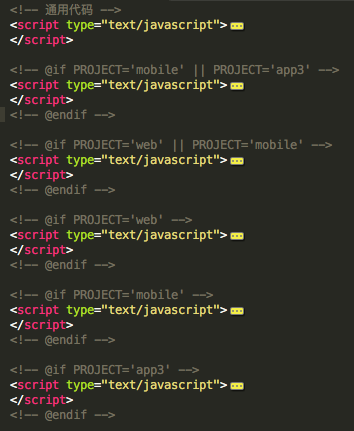
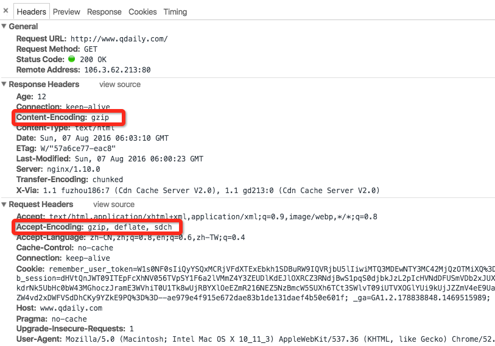
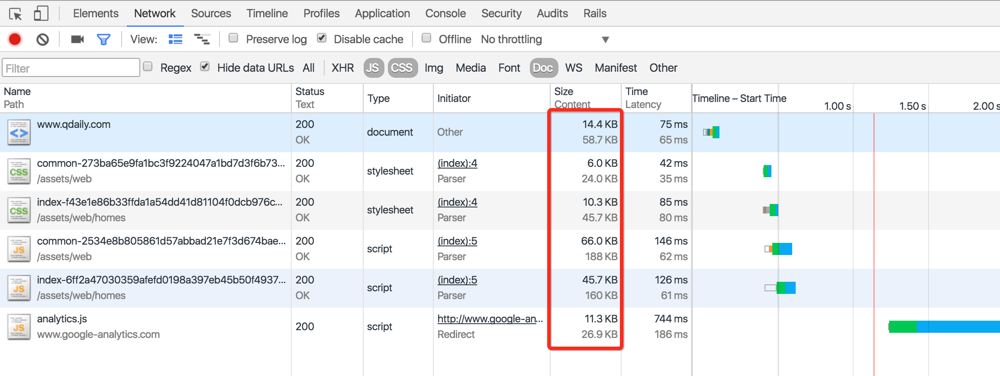
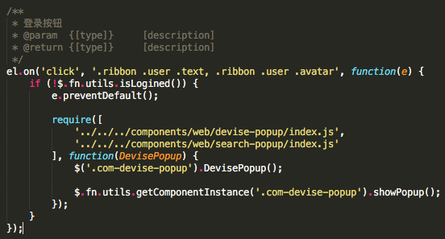
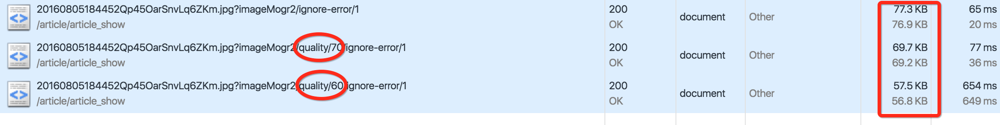
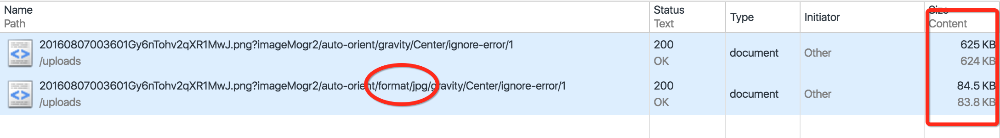
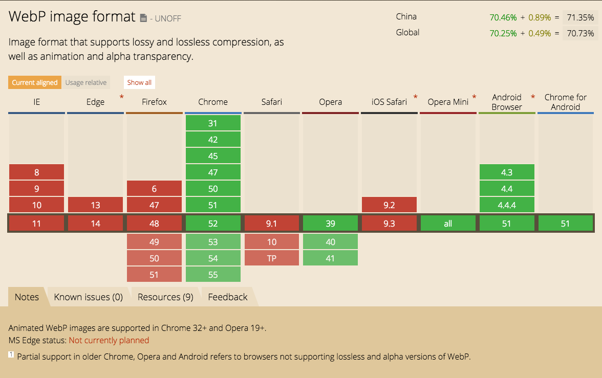
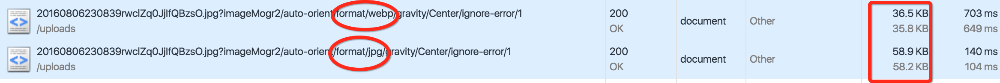
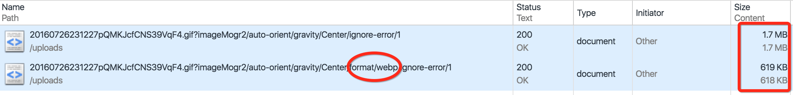
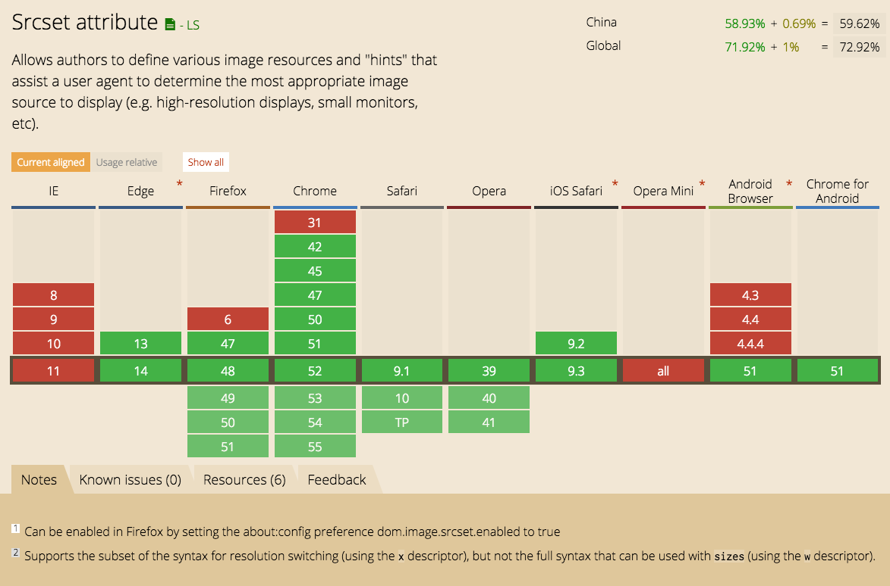

# 移动端性能优化总结（二）

## 如何减小请求大小？

### 1、JS/CSS/HTML压缩

这也是常规手段，就不介绍太多，主要的方式有：<br/>
1、通过构建工具实现，比如webpack/gulp/fis/grunt等。<br/>
2、后台预编译。<br/>
3、利用第三方online平台，手动上传压缩。<br/>
无论是第二种还是第三种方式，都有其局限性，第一种方法是目前的主流方式，凭借良好的插件生态，可以实现丰富的构建任务。<br/>
在我们的项目中，我们使用webpack作为构建系统的基础。<br/>

简单介绍一下JS/CSS/HTML压缩方式和一些注意事项。

<b>JS压缩</b>

JS压缩：使用webpack的UglifyJsPlugin插件，同时做一些代码检测。

```js
new webpack.optimize.UglifyJsPlugin({
    mangle: {
        except: ['$super', '$', 'exports', 'require']
    }
})
```

<b>CSS压缩</b>

CSS压缩：使用cssnano压缩，同时使用postcss做一些自动化操作，比如自动加前缀、属性fallback支持、语法检测等。

```js
    var postcss = [
        cssnano({
            autoprefixer: false,
            reduceIdents: false,
            zindex: false,
            discardUnused: false,
            mergeIdents: false
        }),
        autoprefixer({ browers: ['last 2 versions', 'ie >= 9', '> 5% in CN'] }),
        will_change,
        color_rgba_fallback,
        opacity,
        pseudoelements,
        sorting
    ];
```

<b>HTML压缩</b>

HTML压缩：使用htmlmin压缩HTML，同时对不规范的HTML写法纠正。

```js
// 构建视图文件-build版本
gulp.task('build:views', ['clean:views'], function() {
    return streamqueue({ objectMode: true },
            gulp.src(config.commonSrc, { base: 'src' }),
            gulp.src(config.layoutsSrc, { base: 'src' }),
            gulp.src(config.pagesSrc, { base: 'src/pages' }),
            gulp.src(config.componentsSrc, { base: 'src' })
        )
        .pipe(plumber(handleErrors))
        .pipe(logger({ showChange: true }))
        .pipe(preprocess({ context: { PROJECT: project } }))
        .pipe(gulpif(function(file) {
            if (file.path.indexOf('.html') != -1) {
                return true;
            } else {
                return false;
            }
        }, htmlmin({
            removeComments: true,
            collapseWhitespace: true,
            minifyJS: true,
            minifyCSS: true,
            ignoreCustomFragments: [/<%[\s\S]*?%>/, 
                                    /<\?[\s\S]*?\?>/, 
                                    /<meta[\s\S]*?name="viewport"[\s\S]*?>/]
        })))
        .pipe(gulp.dest(config.dest));
});
```

某个第三方平台要求<meta name="viewport" content="width=device-width, minimum-scale=1.0, maximum-scale=1.0, initial-scale=1.0, user-scalable=no">必须写成小数点格式，而htmlmin默认会将小数格式化为整数，所以额外添加了排除项：/<meta[\s\S]*?name="viewport"[\s\S]*?>/。到现在都没懂这个第三方平台咋想的！

<b>条件编译</b>

由于好奇心日报项目较多，我们费了很大的心思抽离出前端项目，实现了前后分离。但有些场景下，我们为了将相关代码维护在一个文件中，同时又针对不同项目执行不同的逻辑，这时候，强烈推荐使用 gulp-preprocess插件 来实现条件编译。

<br/>

### 2、gzip压缩

gzip压缩也是比较常规的优化手段。前端并不需要做什么实际的工作，后台配置下服务器就行，效果非常明显。如果你发现你的网站还没有配置gzip，那么赶紧行动起来吧。

<b>gzip压缩原理</b>

如果浏览器支持gzip压缩，在发送请求的时候，请求头中会带有Accept-Encoding:gzip。然后服务器会将原始的response进行gzip压缩，并将gzip压缩后的response传输到浏览器，紧接着浏览器进行gzip解压缩，并最终反馈到网页上。

<br/>

<b>gzip压缩效果</b>

那么gzip压缩的效果有多明显呢？保守估计，在已经完成JS/CSS/HTML压缩的基础上，还能降低60-80%左右的大小。

<br/>

但需要注意，gzip压缩会消耗服务器的性能，不能过度压缩。<br/>
所以推荐只对JS/CSS/HTML等资源做gzip压缩。图片的话，托管到第三方的图片建议开启gzip压缩，托管到自己应用服务器的图片不建议开启gzip压缩。

### 3、JS/CSS按需加载

和前面提到的按需打包不同。<br/>
JS/CSS按需打包是预编译发生的事情，保证只打包当前页面相关的逻辑。<br/>
JS/CSS按需加载是运行时发生的事情，保证只加载当前页面第一时间使用到的逻辑。<br/>

那么怎么实现按需加载呢？好奇心日报使用webpack提供的require及require.ensure方法来实现按需加载，值得一提的是，除了指定的按需加载文件列表，webpack还会自动解析回调函数的依赖及指定列表的深层次依赖，并最终打包成一个文件。

<br/>

上诉代码的实现效果是：只有当点击登录按钮的时候，才会去加载登录相关的JS/CSS资源。资源在加载成功后自动执行。

### 4、图片压缩，jpg优化

<b>托管到应用服务器的图片压缩</b>

可以手动处理，也可以通过gulp子任务来处理。<br/>
手动处理的话，推荐一个网站 tinypng ，虽然是有损压缩，但压缩效果极好。<br/>
gulp子任务处理的话，推荐使用gulp-imagemin插件，自动化处理，效果也还不错。<br/>

```js
// 图片压缩
gulp.task('images', function() {
    return gulp.src(config.src)
        .pipe(plumber(handleErrors))
        .pipe(newer(config.dest))
        .pipe(logger({ showChange: true }))
        .pipe(imagemin()) // 压缩
        .pipe(gulp.dest(config.dest));
});
```

<b>托管到第三方平台的图片压缩</b>

比如七牛云平台，他们会有一套专门的方案来对图片压缩，格式转换，裁剪等。只需要在url后面加上对应的参数即可，虽然偶尔会有一些小bug，但整体来说，托管方案比用自家应用服务器方案更优。



<b>jpg优化</b>

除了对图片进行压缩之外，对透明图床没有要求的场景，强烈建议将png转换为jpg，效果很明显！<br/>
如下图，将png格式化为jpg格式，图片相差差不多8倍！



再次强调，可以转换成jpg的图片，强烈建议转换成jpg！

### 5、webp优化 & srcset优化

<b>webp优化</b>

粗略看一眼，卧槽，兼容性这么差，也就安卓浏览器及chrome浏览器对它的支持还算给力。



另一方面，webp优化能在jpg的基础上再降低近50%的大小。其优化效果明显。此外，如果浏览器支持webpanimation，还能对gif做压缩！





兼容性差，但效果好！最终好奇心决定尝试一下。<br/>
1、判断浏览器对webp及webpanimation的兼容性。<br/>
2、如果浏览器支持webp及webpanimation，将其替换成webp格式的图片。<br/>

鉴于浏览器对webp的支持比较局限，我们采用渐进升级的方式来优化：对于不支持webp的浏览器，不做处理；对于支持webp的浏览器，将图片src替换成webp格式。<br/>
那么如何判断webp兼容性呢？

```js
// 检测浏览器是否支持webp
// 之所以没写成回调，是因为即使isSupportWebp=false也无大碍，但却可以让代码更容易维护
(function() {
    function webpTest(src, name) {
        var img = new Image(),
            isSupport = false,
            className, cls;

        img.onload = function() {
            isSupport = !!(img.height > 0 && img.width > 0);

            cls = isSupport ? (' ' + name) : (' no-' + name);
            className = document.querySelector('html').className
            className += cls;

            document.querySelector('html').className = className.trim();
        };
        img.onerror = function() {
            cls = (' no-' + name);
            className = document.querySelector('html').className
            className += cls;

            document.querySelector('html').className = className.trim();
        };

        img.src = src;
    }

    var webpSrc = 'data:image/webp;base64,UklGRiQAAABXRUJQVlA4IBgAAAAwAQCdASoB\
                AAEAAwA0JaQAA3AA/vuUAAA=',
        webpanimationSrc = 'data:image/webp;base64,UklGRlIAAABXRUJQVlA4WAoAAAA\
                            SAAAAAAAAAAAAQU5JTQYAAAD/////AABBTk1GJgAAAAAAAAAAAA\
                            AAAAAAAGQAAABWUDhMDQAAAC8AAAAQBxAREYiI/gcA';

    webpTest(webpSrc, 'webp');
    webpTest(webpanimationSrc, 'webpanimation');
})();
```

借鉴modernizr，实现了检测webp/webpanimation兼容性的函数，从代码中可以看出，检测原理就是模拟下载对应格式的图片，在异步函数中可以得到兼容性结果。

接下来就是替换url为webp格式

```js
// 获取webp格式的src
function _getWebpSrc(src) {
    var dpr = Math.round(window.devicePixelRatio || 1),
        ratio = [1, 1, 1.5, 2, 2, 2],
        elHtml = document.querySelector('html'),
        isSupportWebp = (/(^|\s)webp(\s|$)/i).test(elHtml.className),
        isSupportWebpAnimation = (/(^|\s)webpanimation(\s|$)/i).test(elHtml.className),
        deviceWidth = elHtml.clientWidth,
        isQiniuSrc = /img\.qdaily\.com\//.test(src),
        format = _getFormat(src),
        isGifWebp, isNotGifWebp, regDetailImg;
    
    if (!src || !isQiniuSrc || !format || format == 'webp') {
        return src;
    }

    isNotGifWebp = (format != 'gif' && isSupportWebp);
    isGifWebp = (format == 'gif' && isSupportWebpAnimation);

    // 根据屏幕分辨率计算大小
    src = src.replace(/\/(thumbnail|crop)\/.*?(\d+)x(\d+)[^\/]*\//ig, function(match, p0, p1, p2) {
        if(dpr > 1){
            p1 = Math.round(p1 * ratio[dpr]);
            p2 = Math.round(p2 * ratio[dpr]);

            match = match.replace(/\d+x\d+/, p1 + 'x' + p2)
        }

        return match;
    });

    if(isNotGifWebp || isGifWebp) {
       // 替换webp格式，首页/列表页
        src = src.replace(/\/format\/([^\/]*)/ig, function(match, p1) {
            return '/format/webp';
        });
    }
}
```

::: warning 注意
1、window的屏幕像素密度不一定是整数，mac浏览器缩放之后，屏幕像素密度也不是整数。所以获取dpr一定要取整：dpr = Math.round(window.devicePixelRatio || 1);。<br/>
2、ratio = [1, 1, 1.5, 2, 2, 2]表示：1倍屏使用1倍图，2倍屏使用1.5倍图，3倍屏以上都用2倍图。这儿的规则可以按实际情况来设置。<br/>
3、webp优化更适合托管到第三方的图片，简单修改参数就可以获取不同的图片。<br/>
:::


<b>srcset兼容性</b>



如上所述，在对webp优化的时候，我们顺道模拟实现了srcset：根据屏幕像素密度来设置最适合的图片宽高。<br/>
lazysizes原本提供了srcset选项，也可以借用lazysizes的方案来实现srcset，有兴趣的可以去看看源码。

